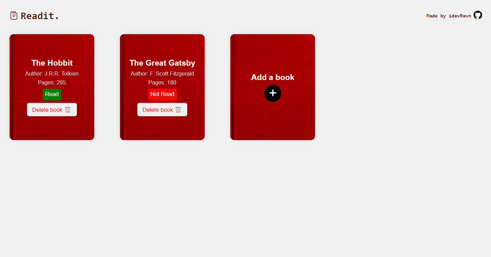

# Readit 📕

Readit is a simple library application that allows users to manage their book collections. It provides an intuitive interface for adding, viewing, and deleting books. Users can easily keep track of their reading list and organize their library efficiently.

## Live Website

https://idevravn.github.io/Readit/

## Table of Contents

- [Features](#features)
- [Getting Started](#getting-started)
- [Built With](#built-with)
- [Contributing](#contributing)
- [License](#license)

## Features

- **Book Collection:** Keep track of your reading list easily.
- **Read or Not Read:** Button for whether you have read the book or not.
- **Delete Button:** Delete a book from the reading list.
- **Add a book:** Add the latest book you want to add to your reading list.
- **More Features:** More features will be added to the Readit Library in the future.

## Getting Started

To view the Readit Website:

1. Clone the repository: `git clone https://github.com/idevRavn/Readit.git`
2. Open `index.html` in your preferred web browser.

## Built With

- HTML
- CSS
- JavaScript

## Contributing

Contributions are welcome! If you have ideas for improvement or want to add features, please fork the repository and submit a pull request.

## License

This project is licensed under the [MIT License](LICENSE), allowing for collaboration and sharing.
